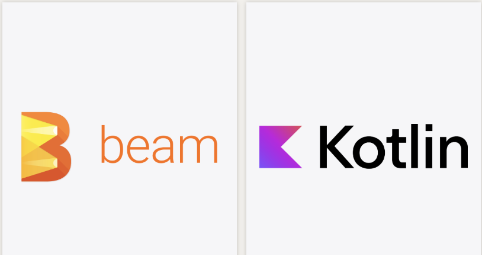

# Midgard



Because **Beam** ❤️ **Kotlin**, we created a new open source library called **Midgard** to :

- Have more concise and expressive code
- Remove **Beam** boilerplate code
- Propose more **Functional Programming** style

This module is a `Beam` wrapper on `Kotlin` and proposes some extensions on `PCollection` `DoFn` and `IO connectors`

Behind the scene `Kotlin` extensions are used, the main advantage of this technic is adding behaviours and methods to 
an existing structure without affecting it.

## Versions compatibility between Beam and Midgard

| Midgard | Beam   |
|---------|--------|
| 0.15.0  | 2.44.0 |
| 0.16.0  | 2.45.0 |
| 0.17.0  | 2.46.0 |
| 0.18.0  | 2.47.0 |
| 0.19.0  | 2.48.0 |
| 0.20.0  | 2.49.0 |
| 0.21.0  | 2.50.0 |
| 0.22.0  | 2.51.0 |

## Installation of project

The project is hosted on Maven repository.\
You can install it with all the build tools compatibles with Maven.

Example with Maven and Gradle :

#### Maven

```xml
<dependency>
    <groupId>fr.groupbees</groupId>
    <artifactId>midgard</artifactId>
    <version>0.22.0</version>
</dependency>
```

#### Gradle

```text
implementation group: 'fr.groupbees', name: 'midgard', version: '0.22.0'
```

## 1- Extensions on PCollection

### 1-1 Usual Beam operators : map, flatMap and filter

Test data :

```kotlin
val psgPlayers = listOf(
    Player(firstName = "Kylian", lastName = "Mbappe", 24),
    Player(firstName = "Marco", lastName = "Verrati", 28)
)

val realPlayers = listOf(
    Player(firstName = "Karim", lastName = "Benzema", 35),
    Player(firstName = "Luca", lastName = "Modric", 39)
)

// Given.
val psgTeam = Team(name = "PSG", slogan = "Ici c'est Paris", psgPlayers)
val realTeam = Team(name = "REAL", slogan = "Hala Madrid", realPlayers)
```

Example of usual `Beam` pipeline with `map`, `flatMap` and `filter` operations : 

```kotlin
val resultPlayers: PCollection<Player> = pipeline
    .apply("Create", Create.of(listOf(psgTeam, realTeam)))
    .apply(
        "To Team with Slogan V2",
        MapElements
            .into(TypeDescriptor.of(Team::class.java))
            .via(SerializableFunction { it.copy(slogan = "${it.slogan} VERSION 2") })
    )
    .apply(
        "To Players",
        FlatMapElements
            .into(TypeDescriptor.of(Player::class.java))
            .via(SerializableFunction { it.players })
    )
    .apply("Filter age > 25", Filter.by(SerializableFunction { it.age > 25 }))
```

The same pipeline with `Midgard` library : 

```kotlin
import fr.groupbees.midgard.*

val resultPlayersMidgard: PCollection<Player> = pipeline
    .apply("Create", Create.of(listOf(psgTeam, realTeam)))
    .map("To Team with Slogan V2") { it.copy(slogan = "${it.slogan} VERSION 2") }
    .flatMap("To Players") { it.players }
    .filter("Filter age > 25") { it.age > 25 }
```

For each operator, there is its equivalent with `Midgard` : 
- `MapElements` -> `map`
- `FlatMapElements` -> `flatMap`
- `Filter` -> `filter`

To use extensions offered by `Midgard`, you have to add the following import in the code : 

```
import fr.groupbees.midgard.*
```

Another big advantage of using `Kotlin` extensions, is the possibility to mix native methods of the `PCollection` with those specific 
to `Midgard`. The previous example contains : 

Native method of the `PCollection`

```kotlin
    .apply("Create", Create.of(listOf(psgTeam, realTeam)))
```

Mixed with extensions and methods brought by `Midgard` : 

```kotlin
    .apply("Create", Create.of(listOf(psgTeam, realTeam)))
    .map("To Team with Slogan V2") { it.copy(slogan = "${it.slogan} VERSION 2") }
    .flatMap("To Players") { it.players }
    .filter("Filter age > 25") { it.age > 25 }
```

The `map`, `flatMap` and `filter` operators take as parameters :
- The name and pipeline step
- Lambda expression or the implementation of the function, to apply the needed operation
- The `Beam` `TypeDescriptor` is deduced inside the operators 

### 1-2 Operators interacting with Beam DoFn lifecycle

`Beam` allows interacting with the [DoFn](https://beam.apache.org/documentation/programming-guide/) 
lifecycle (check **DoFn lifecycle** section) : 
- Setup
- Start Bundle
- Finish Bundle
- Teardown

To be able to use these steps in the lifecycle, we have to create a class that extends `DoFn` and override the 
needed function with the associated annotation, example :

```java
@Setup
public void setup() {
    // Setup action.
}

@StartBundle
public void startBundle() {
    // Start Bundle action.
}

@FinishBundle
public void finishBundle() {
    // Finish Bundle action.
}

@Teardown
public void teardown() {
    // Teardown action.
}
```

`Midgard` allows to propose `map` and `flatMap` operators and extensions while interacting with this lifecycle. 


#### Example with a `map` and an interaction with all the lifecycle functions : 

```kotlin
 val resultTeamMidgardMapLifeCycle: PCollection<Team> = pipeline
    .apply("Create", Create.of(listOf(psgTeam, realTeam)))
    .mapFn(
        name = "To Team with Slogan V2",
        transform = { it.copy(slogan = "${it.slogan} VERSION 2") },
        setupAction = { println("Setup Action") },
        startBundleAction = { println("Start Bundle Action") },
        finishBundleAction = { println("Finish Bundle Action") },
        teardownAction = { println("Teardown Action") }
    )
```

- `name` : the name of the current step
- `transform` : current function containing the transformation logic
- `setupAction` : action executed in the `Setup` `DoFn` lifecycle
- `startBundleAction` : action executed in the `Start Bundle` `DoFn` lifecycle
- `finishBundleAction` : action executed in the `Finish Bundle` `DoFn` lifecycle
- `teardownAction` : action executed in the `Teardown` `DoFn` lifecycle

#### Example with `flatMap` :

```kotlin
 val resultPlayersMidgardFlatMapLifeCycle: PCollection<Player> = pipeline
    .apply("Create", Create.of(listOf(psgTeam, realTeam)))
    .map("To Team with Slogan V2") { it.copy(slogan = "${it.slogan} VERSION 2") }
    .flatMapFn(
        name = "To Players",
        transform = { it.players },
        setupAction = { println("Setup Action") },
        startBundleAction = { println("Start Bundle Action") },
        finishBundleAction = { println("Finish Bundle Action") },
        teardownAction = { println("Teardown Action") }
    )
```

### 1-3 Operators interacting with Beam DoFn lifecycle and context

Sometimes we need to access to the current `ProcessContext` while applying the current transformation.\
It's the case for example when we want to deal with side inputs.

#### Example with a `map` operation

```kotlin
// Simulate a side input for the slogan suffix.
val slogansSideInput: PCollectionView<String> = pipeline
    .apply("Read slogans", Create.of("VERSION 2"))
    .apply("Create as collection view", View.asSingleton())

val resultTeamMidgardMapContextLifeCycle: PCollection<Team> = pipeline
    .apply("Create", Create.of(listOf(psgTeam, realTeam)))
    .mapFnWithContext(
        name = "To Team with Slogan V2",
        transform = { context -> toTeamWithSloganSuffixFromSideInput(slogansSideInput, context) },
        setupAction = { println("Setup Action") },
        sideInputs = listOf(slogansSideInput),
        startBundleAction = { println("Start Bundle Action") },
        finishBundleAction = { println("Finish Bundle Action") },
        teardownAction = { println("Teardown Action") }
    )

private fun toTeamWithSloganSuffixFromSideInput(
    sideInput: PCollectionView<String>,
    context: DoFn<Team, Team>.ProcessContext
): Team {
    val currentTeam: Team = context.element()
    val sloganSuffixSideInput: String = context.sideInput(sideInput)

    return currentTeam.copy(slogan = "${currentTeam.slogan} $sloganSuffixSideInput")
}
```

We simulated a side input with a slogan suffix as a `PCollectionView`.\
The `mapFnWithContext` method gives access to the current `DoFn` `ProcessContext` and allows :
- To retrieve the current `String` value inside the side input
- To retrieve the current `Team` input element 

The `toTeamWithSloganSuffixFromSideInput` method adds the side input suffix to the current slogan and returns 
a copy of the current object with the newly updated slogan field.

#### Example with `flatMap` operation

The principle is the same for `flatMapFnWithContext`, for the sake of simplicity we show an example 
without side input : 

```kotlin
 val resultPlayersMidgardFlatMapContextLifeCycle: PCollection<Player> = pipeline
    .apply("Create", Create.of(listOf(psgTeam, realTeam)))
    .map("To Team with Slogan V2") { it.copy(slogan = "${it.slogan} VERSION 2") }
    .flatMapFnWithContext(
        name = "To Players",
        transform = { context -> context.element().players },
        setupAction = { println("Setup Action") },
        startBundleAction = { println("Start Bundle Action") },
        finishBundleAction = { println("Finish Bundle Action") },
        teardownAction = { println("Teardown Action") }
    )
```

In this example, the current input element in the context is directly returned.

### Next steps and evolutions

The library could add in the future, extensions on native `Beam` IO like :
- TextIO
- BigQueryIO
- ...
